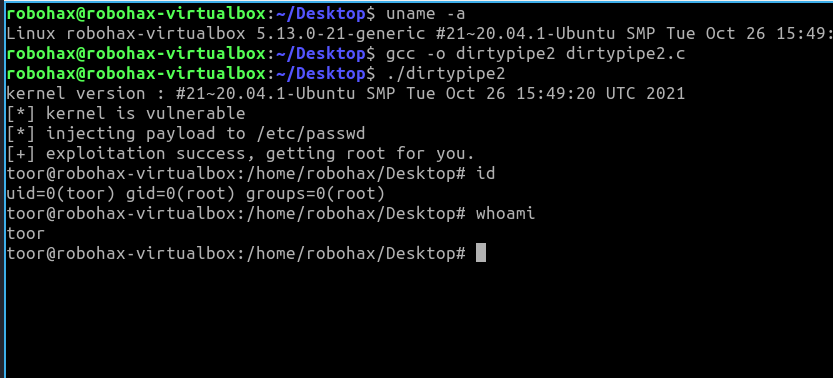
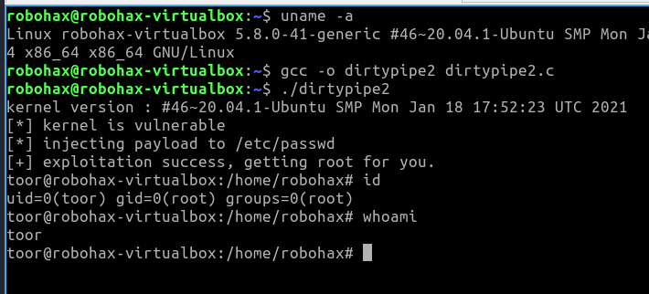

# dirtypipe2
Linux Kernel 5.8 &lt; 5.15.25 - Local Privilege Escalation (DirtyPipe 2)

Exploit Author: Antonius (w1sdom) 
github : https://github.com/bluedragonsecurity 
web : https://www.bluedragonsec.com 
 
tested on : 
- linux kernel 5.13.0-21-generic (compiled on lubuntu 20.04.5) 
- linux lubuntu 20.04.2 - linux kernel 5.8
 
Original Author: Max Kellermann (max.kellermann@ionos.com) 
CVE: CVE-2022-0847 
Copyright 2022 CM4all GmbH / IONOS SE 
 

  

